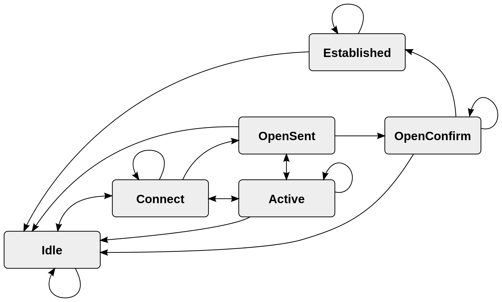

#***Knowledge Center***

## **EXSi Server**

 The ESXi Server is an advanced, smaller-footprint version of the VMware ESX Server, VMware's enterprise level computer virtualization software product. Implemented within the VMware Infrastructure, ESXi can be used to facilitate centralized management for enterprise desktops and data center applications. VMware ESXi (formerly ESX) is an enterprise class, type 1 hypervisor developed by VMware for deploying and serving virtual computers. As a type 1 hypervisor, ESXi is not a software application that is installed on an operating system (OS); instead, it includes and integrates vital OS components, such as a kernel.

## **CSR1000v**

 The Cisco Cloud Services Router 1000V (CSR 1000V) is a router and network services platform in virtual form factor that is intended for deployment in cloud and virtual data centers and runs independently on an x86 machine. As a result, the Cisco CSR 1000v Series architecture has unique attributes that differentiate it from hardware based router platforms. It is optimized to serve as a single tenant or multitenant WAN gateway. Using proven, industry leading Cisco IOS XE Software networking and security features, the CSR 1000V enables enterprises to transparently extend their WANs into external provider hosted clouds and cloud providers to offer their tenants enterprise class networking services.

For more information visit <https://www.cisco.com/c/en/us/products/collateral/routers/cloud-services-router-1000v-series/data_sheet-c78-733443.html>

## **BGP**

 Border Gateway Protocol (BGP) is a standardized exterior gateway protocol designed to exchange routing and reachability information among autonomous systems (AS) on the Internet. The protocol is classified as a path vector protocol. The Border Gateway Protocol makes routing decisions based on paths, network policies, or rule-sets configured by a network administrator and is involved in making core routing decisions. The Border Gateway Protocol has been in use on the Internet since 1994. The current version of BGP is version 4 (BGP4), which was published as RFC 4271 in 2006, the major enhancement was the support for Classless Inter Domain Routing (CIDR) and use of route aggregation to decrease the size of routing tables.
 
 BGP neighbors, called peers, are established by manual configuration among routers to create a TCP session on port 179. A BGP speaker sends 19 byte keep alive messages every 60 seconds to maintain the connection. Among routing protocols, BGP is unique in using TCP as its transport protocol. When BGP runs between two peers in the same autonomous system (AS), it is referred to as Internal BGP (iBGP or Interior Border Gateway Protocol). When it runs between different autonomous systems, it is called External BGP (eBGP or Exterior Border Gateway Protocol). Routers on the boundary of one AS exchanging information with another AS are called border or edge routers or simply eBGP peers and are typically connected directly, while iBGP peers can be interconnected through other intermediate routers.

 In order to make decisions in its operations with peers, a BGP peer uses a simple finite state machine (FSM) that consists of six states: *Idle*; *Connect*; *Active*; *OpenSent*; *OpenConfirm*; and *Established*. For each peer-to-peer session, a BGP implementation maintains a state variable that tracks which of these six states the session is in. The BGP defines the messages that each peer should exchange in order to change the session from one state to another. The first state is the "***Idle***" state. In the "***Idle***" state, BGP initializes all resources, refuses all inbound BGP connection attempts and initiates a TCP connection to the peer. The second state is "***Connect***". In the "***Connect***" state, the router waits for the TCP connection to complete and transitions to the "***OpenSent***" state if successful. If unsuccessful, it starts the ConnectRetry timer and transitions to the "***Active***" state upon expiration. In the "***Active***" state, the router resets the ConnectRetry timer to zero and returns to the "***Connect***" state. In the "***OpenSent***" state, the router sends an Open message and waits for one in return in order to transition to the "***OpenConfirm***" state. Keepalive messages are exchanged and, upon successful receipt, the router is placed into the "***Established***" state. In the "***Established***" state, the router can send/receive: Keepalive; Update; and Notification messages to/from its peer.

## **CEF**

Cisco Express Forwarding (CEF) is advanced, Layer 3 IP switching technology. CEF optimizes network performance and scalability for networks with large and dynamic traffic patterns, such as the Internet, on networks characterized by intensive Web based applications, or interactive sessions.

 CEF offers the following benefits:

 ***Improved performance*** : CEF is less CPU intensive than fast switching route caching. More CPU processing power can be dedicated to Layer3 services such as Quality of Service (QoS) and encryption.

 ***Scalability*** : CEF offers full switching capacity at each line card when dCEF mode is active.

 ***Resilience*** : CEF offers an unprecedented level of switching consistency and stability in large dynamic networks.

 Because the Forwarding Information Base (FIB) lookup table contains all known routes that exist in the routing table, it eliminates route cache maintenance and the fast-switch or process-switch forwarding scenario. CEF can switch traffic more efficiently than typical demand caching schemes.

 CEF consists of Forwarding Information Base and Adjacency Tables.

 ***Forwarding Information Base*** : CEF uses a FIB to make IP destination prefix-based switching decisions. The FIB is conceptually similar to a routing table or information base. It maintains a mirror image of the forwarding information contained in the IP routing table. When routing or topology changes occur in the network, the IP routing table is updated, and those changes are reflected in the FIB. The FIB maintains next hop address information based on the information in the IP routing table.

 Because there is a one-to-one correlation between FIB entries and routing table entries, the FIB contains all known routes and eliminates the need for route cache maintenance that is associated with switching paths such as fast switching and optimum switching.

 ***Adjacency Tables*** : Nodes in the network are said to be adjacent if they can reach each other with a single hop across a link layer. CEF uses adjacency tables to prepend Layer 2 addressing information. The adjacency table maintains Layer 2 next hop addresses for all FIB entries.

## **MScGEN**
 
 Mscgen is a small program that parses Message Sequence Chart descriptions and produces PNG, SVG, EPS or server side image maps (ismaps) as the output. Message Sequence Charts (MSCs) are a way of representing entities and interactions over some time period and are often used in combination with SDL. MSCs are popular in Telecoms to specify how protocols operate although MSCs need not be complicated to create or use. Mscgen aims to provide a simple text language that is clear to create, edit and understand, which can also be transformed into common image formats for display or printing. 

 For more information visit <https://mscgen.js.org/>

## **FLASK**

 Flask is a micro web framework written in Python. It is classified as a micro framework because it does not require particular tools or libraries. It has no database abstraction layer, form validation, or any other components where preexisting third party libraries provide common functions. However, Flask supports extensions that can add application features as if they were implemented in Flask itself. Extensions exist for object relational mappers, form validation, upload handling, various open authentication technologies and several common framework related tools.

 For more information visit <https://flask.palletsprojects.com/en/1.1.x/>

## **Bootstrap**

 Bootstrap is a free and open source CSS framework directed at responsive, mobile-first front end web development. It contains CSS and (optionally) JavaScript based design templates for typography, forms, buttons, navigation, and other interface components. 
 
 For more information visit <https://getbootstrap.com/>

## **CISCO UI**

 Cisco UI Kit is a modern, lightweight, responsive and programmable presentation layer that can be used to style HTML primitive elements. 
 
 For more information visit <https://developer.cisco.com/site/uiux/>

## **DOCKER**

 Docker is a set of platform as a service (PaaS) products that uses OS-level virtualization to deliver software in packages called containers. Containers are isolated from one another and bundle their own software, libraries and configuration files; they can communicate with each other through well defined channels. All containers are run by a single operating system kernel and therefore use fewer resources than virtual machines. The software that hosts the containers is called Docker Engine. It was first started in 2013 and is developed by Docker, Inc. Docker can package an application and its dependencies in a virtual container that can run on any Linux server. This helps provide flexibility and portability enabling the application to be run in various locations.
Docker implements a high level API to provide lightweight containers that run processes in isolation.

 The Docker software as a service offering consists of three components:

 ***Software***: The Docker daemon, called *dockerd*, is a persistent process that manages Docker containers and handles container objects.

 ***Objects***: Docker objects are various entities used to assemble an application in Docker. The main classes of Docker objects are images, containers, and services.

 ***Registries***: A Docker registry is a repository for Docker images. Docker clients connect to registries to download ("pull") images for use or upload ("push") images that they have built. Registries can be public or private. Two main public registries are Docker Hub and Docker Cloud.

The Docker software tools are:
 
 ***Docker Compose*** is a tool for defining and running multi-container Docker applications. It uses YAML files to configure the application's services and performs the creation and start-up process of all the containers with a single command.

 ***Docker Swarm*** provides native clustering functionality for Docker containers, which turns a group of Docker engines into a single virtual Docker engine. In Docker 1.12 and higher, Swarm mode is integrated with Docker Engine.
 
For more information visit <https://www.docker.com>

 
## **BGP Hijacking**

 
 BGP hijacking is the illegitimate takeover of groups of IP addresses by corrupting Internet routing tables maintained using the Border Gateway Protocol (BGP).

 The Internet is a global network in enabling any connected host, identified by its unique IP address, to talk to any other, anywhere in the world. This is achieved by passing data from one router to another, repeatedly moving each packet closer to its destination, until it is hopefully delivered. To do this, each router must be regularly supplied with up-to-date routing tables. At the global level, individual IP addresses are grouped together into prefixes. These prefixes will be originated, or owned, by an autonomous system (AS) and the routing tables between ASes are maintained using the Border Gateway Protocol (BGP). 

 A group of networks that operate under a single external routing policy is known as an autonomous system. Each AS has its own unique AS identifier number. BGP is the standard routing protocol used to exchange information about IP routing between autonomous systems. Each AS uses BGP to advertise prefixes that it can deliver traffic to. Although security extensions are available for BGP, and third-party route DB resources exist for validating routes, by default the BGP protocol is designed to trust all route announcements sent by peers, and few ISPs rigorously enforce checks on BGP sessions.

 IP hijacking can occur deliberately or by accident in one of several ways:

 *An AS announces that it originates a prefix that it does not actually originate.*
 
 *An AS announces a more specific prefix than what may be announced by the true originating AS.* 

 *An AS announces that it can route traffic to the hijacked AS through a shorter route than is already available, regardless of whether or not the route actually exists.*

 Common to these ways is their disruption of the normal routing of the network: packets end up being forwarded towards the wrong part of the network and then either enter an endless loop (and are discarded), or are found at the mercy of the offending AS. 

 Typically ISPs filter BGP traffic, allowing BGP advertisements from their downstream networks to contain only valid IP space. However, a history of hijacking incidents shows this is not always the case. 

 The Resource Public Key Infrastructure (RPKI) is designed to authenticate route origins via cryptographic certificate chains demonstrating address block range ownership, but is not widely deployed yet. Once deployed, IP hijacking through errant issues at the origin (via accident or intent) should be detectable and filterable. IP hijacking is sometimes used by malicious users to obtain IP addresses for use in spamming or a distributed denial of service (DDoS) attack. 

## **BGPMon**
 
 BGPmon helps you assess the routing health of your network, providing you with information which allows you to determine the stability of your networks and potential risks to your data. BGPmon monitors the routing of your prefixes and alerts you in case of an 'interesting' path change. Path changes can be of different kinds, such as more specifics, change of ASpath, change of origin AS, Transit AS or any combination of these, leading to such threats as blackholed traffic or traffic redirection and interception.

 For more information visit <https://bgpmon.net/>

