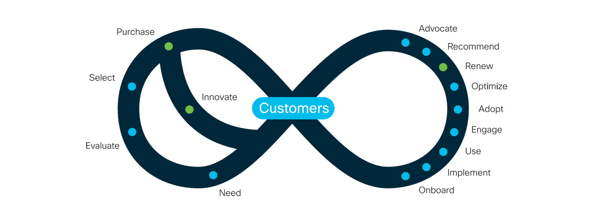

#***About Us***
## **Cisco Systems, Inc.**

Cisco Systems, Inc. is an American multinational technology conglomerate headquartered in San Jose, California, in the center of Silicon Valley. Cisco develops, manufactures and sells networking hardware, software, telecommunications equipment and other high technology services and products.

  Cisco Systems was founded in December 1984 by Sandy Lerner, a director of computer facilities for the Stanford University Graduate School of Business. Lerner partnered with her husband, Leonard Bosack, who was in charge of the Stanford University computer science department's computers. The name "Cisco" was derived from the city name San Francisco, which is why the company's engineers insisted on using the lower case "cisco" in its early years. The logo is intended to depict the two towers of the Golden Gate Bridge.

   Cisco's products and services focus upon three market segments: enterprise, service provider, midsize and small business. Cisco provides IT products and services across five major technology areas: Networking (including Ethernet, optical, wireless and mobility), Security, Collaboration (including voice, video, and data), Data Center, and the Internet of Things.

## **Customer eXperience (CX)**

  ***Cisco Customer Experience*** is an organization that puts all of Cisco behind you, at every step of your technology lifecycle. We are keeping the best of what you love about Cisco today, but mapping this into a streamlined model for engaging with you, customers and partners.

 ***Our commitment*** is to help you get more value from technology, faster, whether you are focused on optimizing your current investments or making the most audacious transformations.

 Its all about the journey and At Cisco Customer Experience, we are with you in this journey helping you move faster every step of the way to

 *Achieve your vision together with insight and expertise*
 
 *Deliver projects at the most ambitious scale and speed*
 
 *Capture opportunities with data and digital platforms*
 

## **Service Providers**

We simplify, automate and virtualize for a more agile and innovative network

 ***We reduce time to market*** : Improve your customer experience and take new solutions to market faster than ever before

 ***We automate costly manual functions*** : Improve internal efficiencies and cut operational expenses. Smart analytics solutions deliver the right data to the right person at the right time.

 ***Manage your network transformations*** : Empower your teams with the latest network engineer and software developer education. Access online learning libraries, virtual labs and training, curriculum planning and professional certifications.

## **Our Team**

