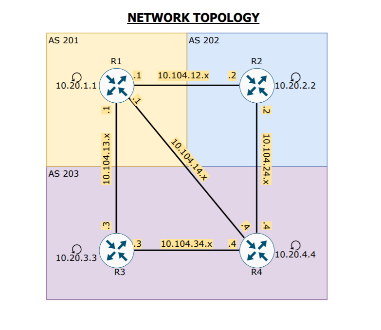
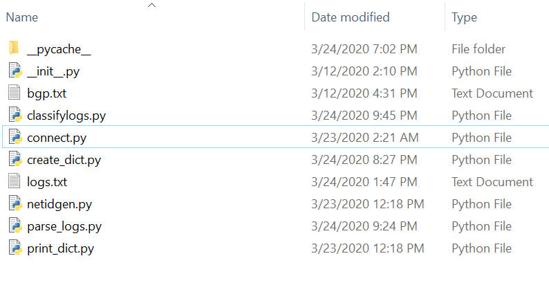
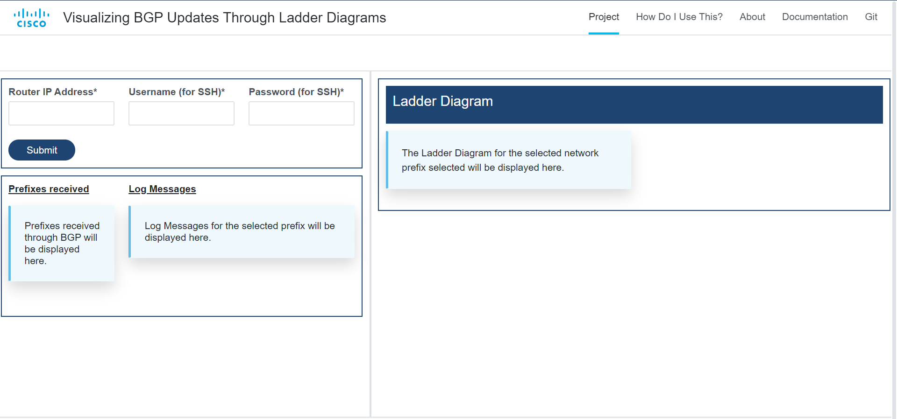
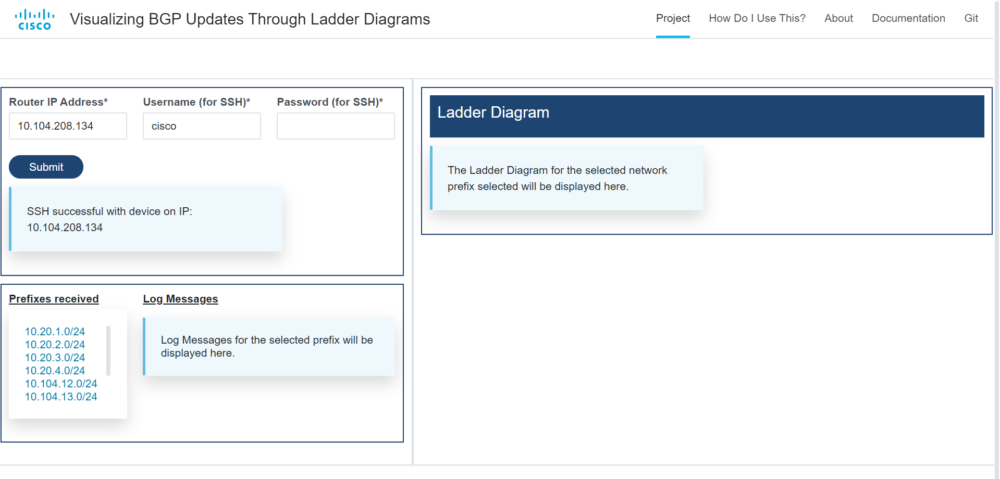
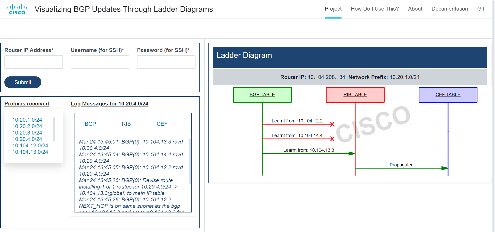

##**Ladder Diagram : BGP**

--------------------------------


##**Problem Statement and Project Overview**


BGP is the backbone protocol of the internet. Deploying BGP in your network ensures the security of the routing information exchange and the stability of the network. Troubleshooting the flow of BGP updates inside a router is very difficult and time consuming as the log messages are innumerable. Our project was to intuitively help in troubleshooting by creating a tool to visualize the flow of BGP updates (including the best path selection) inside a router (prefix propagation from BGP all the way upto CEF) using ladder diagrams and display only the relevant log messages. This project was done with the motive to enhance the support serviceability effort.


##**Network Setup and Configuration of devices**


The topology we designed required 4 CSR1000v routers .All of them were hosted in ESXi server. The diagram below depicts the network setup:




The bgp configured in router 1 is shown below

```
router bgp 201
bgp log-neighbor-changes
network 10.20.1.0 mask 255.255.255.0
network 10.104.12.0 mask 255.255.255.0
network 10.104.13.0 mask 255.255.255.0
network 10.104.14.0 mask 255.255.255.0
neighbor 10.104.12.2 remote-as 202
neighbor 10.104.13.3 remote-as 203
neighbor 10.104.14.4 remote-as 203
```

The bgp configured in router 2 is shown below 

```
router bgp 202
bgp log-neighbor-changes
network 10.20.2.0 mask 255.255.255.0
network 10.104.12.0 mask 255.255.255.0
network 10.104.24.0 mask 255.255.255.0
neighbor 10.104.12.1 remote-as 201
neighbor 10.104.12.1 weight 100
neighbor 10.104.24.4 remote-as 203
neighbor 10.104.24.4 weight 400`
```

The bgp configured in router 3 is shown below

```
router bgp 203
bgp log-neighbor-changes
bgp default local-preference 300
network 10.20.3.0 mask 255.255.255.0
network 10.104.13.0 mask 255.255.255.0
network 10.104.34.0 mask 255.255.255.0
neighbor 10.104.13.1 remote-as 201
neighbor 10.104.13.1 weight 100
neighbor 10.104.34.4 remote-as 203
neighbor 10.104.34.4 weight 100`
```

The bgp configured in router 4 is shown below

```
router bgp 203
bgp log-neighbor-changes
network 10.20.4.0 mask 255.255.255.0
network 10.104.14.0 mask 255.255.255.0
network 10.104.24.0 mask 255.255.255.0
network 10.104.34.0 mask 255.255.255.0
neighbor 10.104.14.1 remote-as 201
neighbor 10.104.14.1 weight 100
neighbor 10.104.24.2 remote-as 202
neighbor 10.104.24.2 weight 100
neighbor 10.104.34.3 remote-as 203
neighbor 10.104.34.3 weight 100`
```                           

##**Collecting the Required Logs**


 A python script has been written to automate the process of collecting the required logs. To facilitate modular programming we have created functions, modules and a python package. Modularizing the code will help in user readability, reusability and maintainability by reducing the interdependency between the various modules. Our python package named bgp_p2 contains 6 modules. They are:





 The `connect.py` module helps in SSH (Secure Shell) connection into the required router using the ip address, username and password entered by the user. Further the required debugs are enabled and `term length 0` is enabled so as to get all lines in a single command.

 The `create_dict` module first checks whether BGP is configured on the router and if not it generates the relevant message. Else it creates a nested dictionary with the network ID along with its mask (taken from the bgp table)as the key to the outer dictionary and each of the key is mapped with multiple values  which are *bgp*,*rib*,*cef* and they are the keys to the inner dictionary which have empty lists as value ( again single key mapped to multiple value). 


The `parse_logs.py` module contains a parse function which takes the dictionary and the masks (of the destination prefixes) as arguments. Using re.findall(), all IP addresses are picked up from the logs generated and network ID it belongs to is found by calling the `netidgen.py` which contains a networkID(). networkID()takes the ip address and mask as arguments and returns the network ID. We employ re.search() to find if the network ID matches the key of the dictionary. If it does, then the log message is searched for the keywords *BGP*,*RT* and *FIB* and accordingly classified into the lists paired with the key *bgp*,*rib* and *cef*.

 By default if the same IP address exists with 2 subnet masks in the BGP table then it will choose the one with the longest mask and this scenario is taken care of in our code.

 The `classifylogs.py` contains a function clfy() which takes the dictionary created , the destination prefix and the learnt from address as arguments and helps in classifying the already existing relevant logs based on the learnt from addresses. This allows us to display only the logs learnt from that particular address for the required destination prefix.

 The `print_dict.py` contains a function called printdic() which takes the dictionary as arguments and prints it in the required format.

 The text files : `bgp.txt` contains the bgp table and `logs.txt` contains the logs. 

 Please visit <https://gitlab-sjc.cisco.com/users/sign_in> for the code 


##**Creating Ladder Diagrams**

 A python script is written which has a function called *ladder_diagram()* and it has two functions inside namely: *rib_check()* and *cef_check()*.

  *cef_check()* checks whether the destination prefix is present in the CEF table. Then it searches for the CEF interface from the output of CEF exact-route for both the scenarios of: if the next hop exist or it is directly connected. With the CEF interface obtained, it enters the *cef_int_check()* function which checks whether the CEF next hops match the RIB next hops, if it matches then the BGP Update is successful from RIB to CEF else it is not propagated. In Both the scenarios the appropriate output messages are printed.

 *rib_check()* not only finds all the BGP entries for that destination prefix in the RIB table but also the best path to reach the destination prefix. If there is a static route or they are directly connected or the route does not have a RIB entry then appropriate messages are shown.

  The outputs generated by this *ladder_diagram()* are the inputs to be given to MscGen to create the required ladder diagrams.


##**Flask Application and Cisco UI**


 Flask, a web framework provides us with tools, libraries and technologies that allow us to build a web application. This web application can be some web pages, a blog, and a wiki or go as big as a web-based calendar application or a commercial website.
Flask is part of the categories of the micro-framework which are with little to no dependencies to external libraries. This has pros and cons. Pros would be that the framework is light, there are little dependency to update and watch for security bugs, cons is that some time you will have to do more work by yourself or increase yourself the list of dependencies by adding plugins.

 The User Interface (UI) has been designed with the help of HTML, CSS, bootstrap and templates from standard Cisco UI Toolkit.
The integration of our python scripts to the UI has been achieved by flask, weather to pass the input from UI to python script or to render any html page, flask has been used as a middleman. Along with it, jinja2 template is used for conditioning inside the html page so that the code can be more fluent.

##**Sample Outputs**

------------------------------------------------------------------------------------------



The UI consists of a simple webpage which asks for the IP address of the device to SSH into, upon submitting which, the backend python script runs, connecting over SSH to the device, collecting BGP details, and extracts the BGP prefixes advertised to that device, which are then displayed to the user.





As shown in the above screenshot, the prefixes received are displayed for further input. Upon clicking on a network prefix, the tool then connects to the device again, collects logs, parses them for relevant ones, and then also generates a Ladder Diagram from all the information collected, as shown below:





Finally, clicking on any of the propagation arrows in the Ladder Diagram filters the logs further to only display the ones from that particular BGP neighbour.


##**Dockerization**


The whole project runs as a Flask app and has been dockerized to run on any platform. The base OS is Ubuntu:18.04, selected for it's vast support and stability. The Dockerfile is very simple, with just a few instructions to install the depedenices required namely Flask, FlaskForms and Paramiko. The Dockerfile looks something like this:


```
FROM ubuntu:18.04

LABEL maintainer="Vishwas Deshpande <vishwdes@cisco.com>"
RUN apt-get update
RUN apt-get install -y python3 python3-pip

COPY ./ ./app
WORKDIR ./app

RUN pip3 install flask 
RUN pip3 install flask-wtf 
RUN pip3 install paramiko

ENTRYPOINT ["python3"]
CMD ["main.py"]

```

The Docker Image is available on <https://containers.cisco.com/vishwdes/bgp_ladders> for distribution.


##**Future Scope**


This project is a step in the direction of automation of network maintainance and troubleshooting, which is the latest trend in networking. Hence there exist many extensions to this project which are possible, either expanding it's scope, or adding more functionality in the current scope itself. Some of the ideas which pop up are:

 * Adding further functionality for radioactive tracing of BGP updates. 
 * Incorporating features to also enable users to use this as a learning tool. 
 * Expanding support to various other exterior gateway protocols
 * Incorporating anomaly detection in BGP networks


